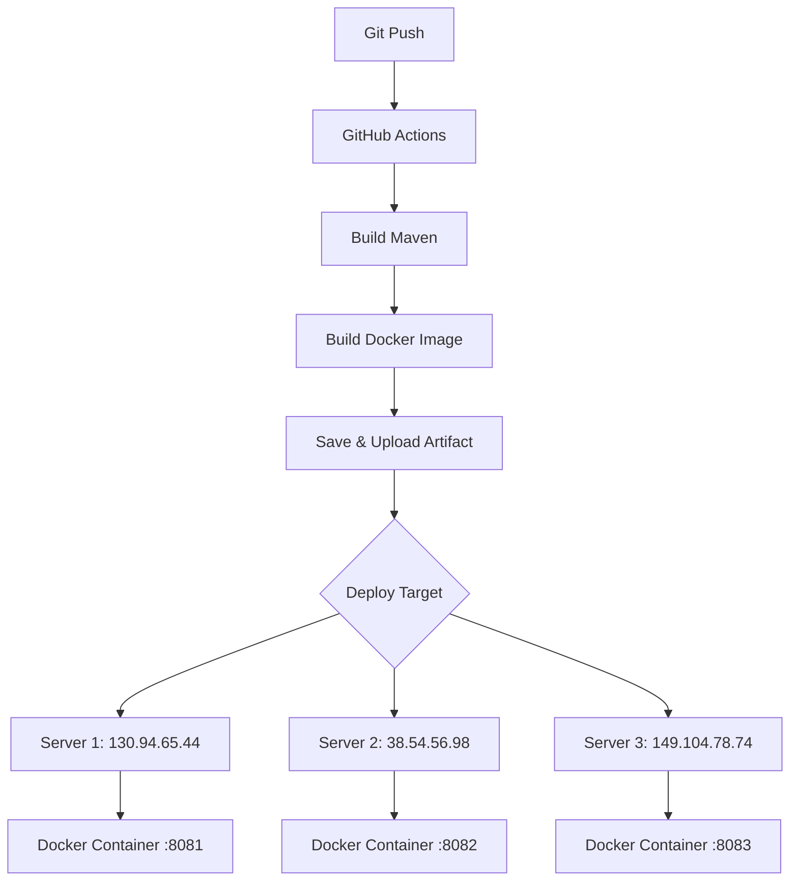
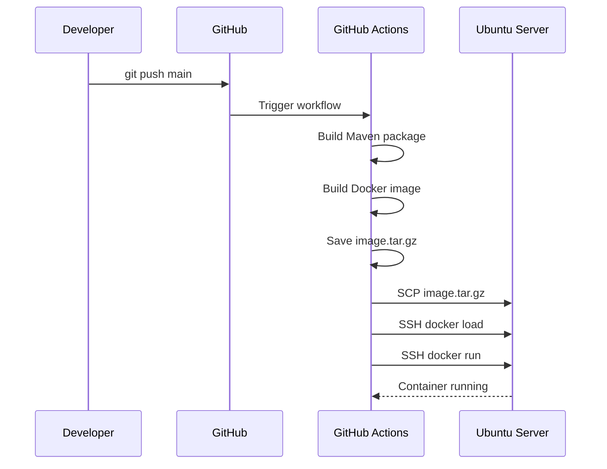

# Deploy Implementation - Sub-Server

## Overview

Quy trình CI/CD deploy Sub-Server lên 3 Ubuntu servers sử dụng GitHub Actions và Docker.

## Architecture



## Servers

| Server | IP | Port | Role |
|--------|-----|------|------|
| Server 1 | 130.94.65.44 | 8081 | Sub-Server Instance |
| Server 2 | 38.54.56.98 | 8082 | Sub-Server Instance |
| Server 3 | 149.104.78.74 | 8083 | Sub-Server Instance |

## Files

| File | Path | Description |
|------|------|-------------|
| Dockerfile | `/Dockerfile` | Multi-stage build với JDK 21 |
| Workflow | `/.github/workflows/deploy.yml` | GitHub Actions CI/CD |
| Deploy Script | `/scripts/deploy.sh` | Manual deploy script |

## GitHub Secrets Required

```
SERVER_1_HOST=130.94.65.44
SERVER_2_HOST=38.54.56.98
SERVER_3_HOST=149.104.78.74
SERVER_USERNAME=root
SERVER_PASSWORD=***
```

## Deploy Flow



## Usage

### Automatic Deploy (Push to main)
```bash
git push origin main
# Deploys to all 3 servers automatically
```

### Manual Deploy (GitHub Actions)
1. Go to Actions tab
2. Select "Build and Deploy Sub-Server"
3. Click "Run workflow"
4. Choose target server (1, 2, 3, or all)

### Local Deploy Script
```bash
# Deploy to all servers
./scripts/deploy.sh all

# Deploy to specific server
./scripts/deploy.sh 1  # Server 1
./scripts/deploy.sh 2  # Server 2
./scripts/deploy.sh 3  # Server 3
```

## Docker Commands on Server

```bash
# Check container status
docker ps -a | grep sub-server

# View logs
docker logs sub-server

# Restart container
docker restart sub-server

# Stop container
docker stop sub-server

# Remove container
docker rm sub-server
```

## Server Setup (First Time)

```bash
# Install Docker on Ubuntu
sudo apt update
sudo apt install -y docker.io
sudo systemctl enable docker
sudo systemctl start docker
```

## Health Check

```bash
# Check server health
curl http://<server-ip>:<port>/actuator/health

# Example
curl http://130.94.65.44:8081/actuator/health
```
